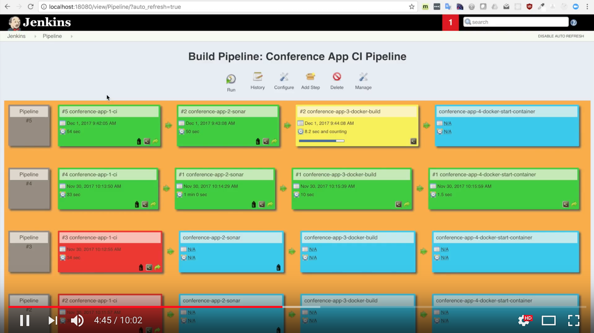
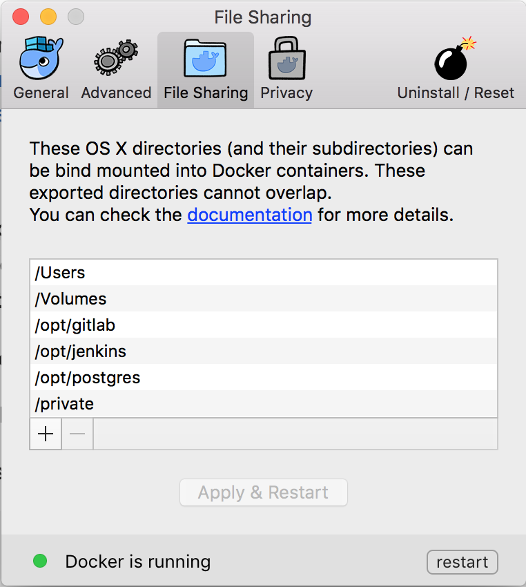

# CI Tools Demo

This GitHub repository contains Dockerfiles for running a set of Continuous Integration Tools with a single command. The diagram contains all tools used in the Docker containers.


Blog article on the CI Docker Container, https://blog.codecentric.de/en/2015/10/continuous-integration-platform-using-docker-container-jenkins-sonarqube-nexus-gitlab

> I use this repository for workshops. This is not production ready.
> For production I use a configuration management tool like Ansible to provision all docker containers and store passwords and keys in ansible vault.
> See https://www.slideshare.net/MarcelBirkner/continuous-delivery-in-enterprise-environments-using-docker-ansible-and-jenkins

# Docker CI Toolstack screencast

You can watch a short video that shows most features of this demo, without having to install docker.

[](https://www.youtube.com/watch?v=lD5u22q6lgs&feature=youtu.be "Docker CI Toolstack screencast")

# Mac User

## With Docker Toolbox (incl. VirtualBox)

see [README-LEGACY.md](README-LEGACY.md)

## With Docker Mac Native

If you want to use new Docker Mac Native implementation without VirtualBox and Docker Toolbox, follow these steps:

### Step 0 - Install Docker Mac Native

Install Docker Mac Native (https://docs.docker.com/docker-for-mac/)[https://docs.docker.com/docker-for-mac/] and if you had Toolbox before, make sure to follow these steps here https://docs.docker.com/docker-for-mac/docker-toolbox/

or install via __brew update__ & __brew cask install docker --force__ .

If everything went fine, docker --version should give something like this (or a higher version number):

```
$ docker --version
Docker version 17.09.0-ce, build afdb6d4

$ docker-compose --version
docker-compose version 1.16.1, build 6d1ac21
```

If there´s also docker-machine on your machine, don´t forget to do the mentioned steps [here](https://docs.docker.com/docker-for-mac/docker-toolbox/) to remove it.

### Step 1 - Create needed osxfs mountpoints

Create folders (see [Issue 26](https://github.com/marcelbirkner/docker-ci-tool-stack/issues/26))

Create a folder in the root directory "/" (Macintosh HD) and name it as __opt__

  Procedure:
  * First __$ cd /__ into the root directory "/"
  * Second __$ sudo mkdir /opt__

Then create the sub folders jenkins, postgres, gitlab in the "opt" folder.

* /opt/jenkins via __sudo mkdir /opt/jenkins__
* /opt/postgres via __sudo mkdir /opt/postgres__
* /opt/gitlab via __sudo mkdir /opt/gitlab__

Change the owning user to your account, e.g. via __sudo chown yourUserName gitlab/__

Then configure these folders in Docker / Preferences / File Sharing:



### Step 2 - Configure correct path to docker binary

Clone Repository

```
# Clone Repository and startup all docker container
# Option A: clone via https
git clone --recursive https://github.com/marcelbirkner/docker-ci-tool-stack.git

# Option B: if you have your ssh keys configured for your GitHub account
git clone --recursive git@github.com:marcelbirkner/docker-ci-tool-stack.git

cd docker-ci-tool-stack
```

# Getting started

To get all docker containers up and running, in __docker-ci-tool-stack__ use:

```
docker-compose up
```

# Linux Users

### Automatically

Please run **docker-compose.yml.native-docker-fix.sh** before executing **docker-compose up**.
This will fix the Docker binary PATH, see [Issue 24](https://github.com/marcelbirkner/docker-ci-tool-stack/issues/24).
This script patches the docker-compose.yml.

### Manually

Please alter Line 23 in docker-compose.yml under jenkins / volumes from

- /usr/local/bin/docker:/usr/bin/docker

to

- /usr/bin/docker:/usr/bin/docker

This is because '/usr/bin/docker' is the docker binary, see [Issue 24](https://github.com/marcelbirkner/docker-ci-tool-stack/issues/24).

# Selenium Grid

You have start the selenium grid with a separate command, since the selenium container are
not part of the default docker-compose.yml.

```
docker-compose -f docker-compose-selenium.yml up
```

## Access Tools

#### With docker machine

| *Tool* | *Link* | *Credentials* |
| ------------- | ------------- | ------------- |
| Jenkins | http://${docker-machine ip default}:18080/ | no login required |
| SonarQube | http://${docker-machine ip default}:19000/ | admin/admin |
| Nexus | http://${docker-machine ip default}:18081/nexus | admin/admin123 |
| GitLab | http://${docker-machine ip default}/ | root/5iveL!fe |
| Selenium Grid | http://${docker-machine ip default}:4444/grid/console | no login required |
| Conference App | http://${docker-machine ip default}:48080/currentSessions | no login required |

#### With Docker Mac Native

| *Tool* | *Link* | *Credentials* |
| ------------- | ------------- | ------------- |
| Jenkins | http://localhost:18080/ | no login required |
| SonarQube | http://localhost:19000/ | admin/admin |
| Nexus | http://localhost:18081/ | admin/admin123 |
| GitLab | http://localhost | root/5iveL!fe |
| Selenium Grid | http://localhost:4444/grid/console | no login required |
| Conference App | http://localhost:48080/currentSessions | no login required |

## Screenshots

Here is an overview of all tools:

- GitLab is used for storing the Source Code
- Jenkins contains build job and is triggered once projects in GitLab are updated
- As part of the CI build, Jenkins triggers a static code analysis and the results are stored in SonarQube
- The Maven build uses Nexus as a Proxy Repository for all 3rd party libs. The build artifacts are deployed to the Nexus Release Repository
- The Selenium Grid contains Docker containers running Chrome and Firefox and is used for UI tests

### Jenkins Jobs

There are several jobs preconfigured in Jenkins.
The Jobs cover the following tasks:

- Continuous Integration Build with Maven
- Unit Tests
- Static Source Analysis results are stored in SonarQube
- JaCoCo Test Coverage
- Deployment to Nexus
- Jenkins Job DSL examples
- Selenium UI Test


### SonarQube Dashboard


### Nexus Repository


### Selenium Grid


## Testing Upgrades

In order to test new versions, I prefer starting out with a blank VirtualBox image.
That eliminates any side effects. Afterwards you can throw away the image.

```
# Create new image
docker-machine create --driver virtualbox --virtualbox-memory 6000 docker-ci-v1

# Configure shell environment
eval $(docker-machine env docker-ci-v1)
```
