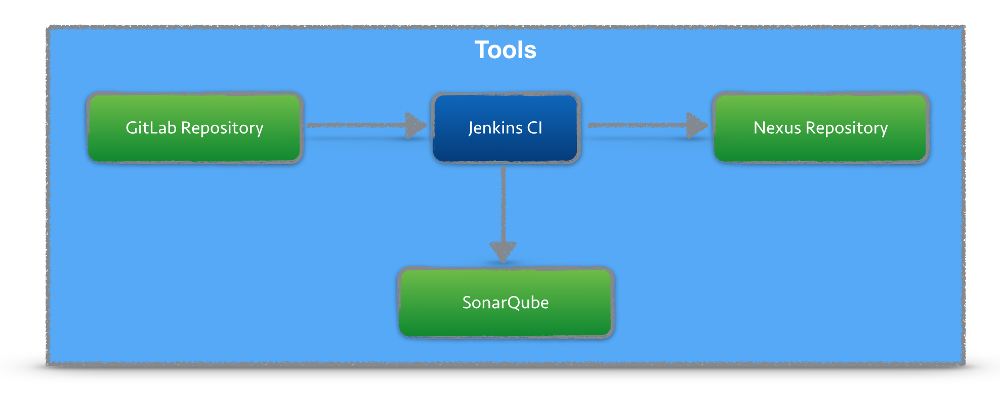
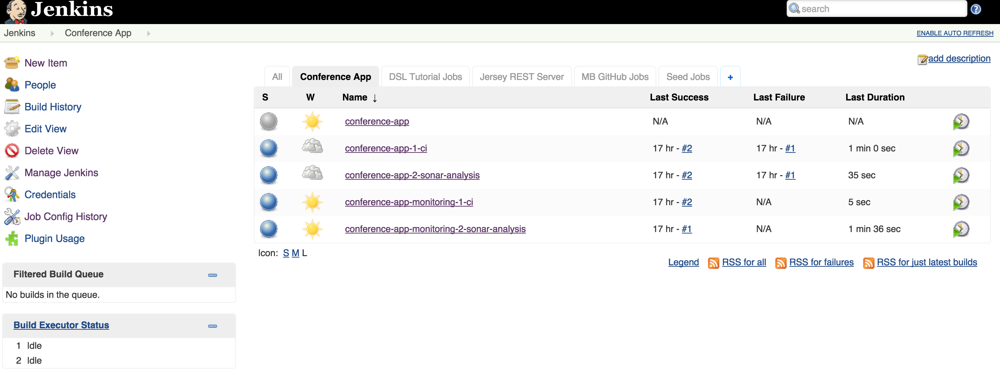
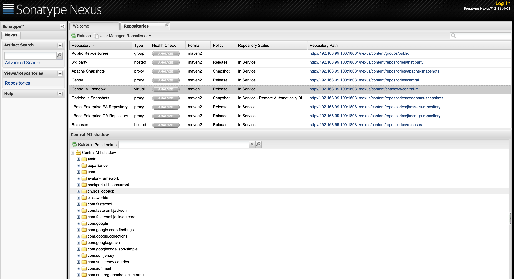
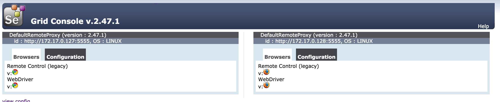

# CI Tools Demo

This GitHub repository contains Dockerfiles for running a set of Continuous Integration Tools with a single command. The diagram contains all tools used in the Docker containers.



Blog article on the CI Docker Container, https://blog.codecentric.de/en/2015/10/continuous-integration-platform-using-docker-container-jenkins-sonarqube-nexus-gitlab

## Prerequisites (Mac)

You should have Docker Toolbox installed, see https://www.docker.com/toolbox

I am using docker-compose to start several docker container at once.
Since all containers run in a single VM (virtualbox), this VM needs enough memory.

### Step 0 - Check Docker Machine version

Ensure that you are using version 0.3.0 or greater of `docker-machine`

```
# docker-machine version
docker-machine version 0.5.4, build
```

### Step 1 - Start Docker Machine

Start the machine, using the `--virtualbox-memory` option to increase it’s memory.
I use 6000 MB to accommodate all the docker images.

```
# docker-machine create -d virtualbox --virtualbox-memory "6000" default
Running pre-create checks...
Creating machine...
(default) Creating VirtualBox VM...
(default) Creating SSH key...
(default) Starting VM...
Waiting for machine to be running, this may take a few minutes...
Machine is running, waiting for SSH to be available...
Detecting operating system of created instance...
Detecting the provisioner...
Provisioning with boot2docker...
Copying certs to the local machine directory...
Copying certs to the remote machine...
Setting Docker configuration on the remote daemon...
Checking connection to Docker...
Docker is up and running!
To see how to connect Docker to this machine, run: docker-machine env default
```

### Step 2 - Set Docker Machine Connection

Configure shell environment to connect to your new Docker instance

```
eval "$(docker-machine env default)"
```

## Getting started

To get all docker containers up and running use:

```
# Clone Repository and startup all docker container
git clone git@github.com:marcelbirkner/docker-ci-tool-stack.git
cd docker-ci-tool-stack
docker-compose up
```

## Access Tools

| *Tool* | *Link* | *Credentials* |
| ------------- | ------------- | ------------- |
| Jenkins | http://${docker-machine ip default}:18080/ | no login required |
| SonarQube | http://${docker-machine ip default}:19000/ | admin/admin |
| Nexus | http://${docker-machine ip default}:18081/nexus | admin/admin123 |
| GitLab | http://${docker-machine ip default}/ | root/5iveL!fe |
| Selenium Grid | http://${docker-machine ip default}:4444/grid/console | no login required |

## Screenshots

Here is an overview of all tools:

- GitLab is used for storing the Source Code
- Jenkins contains build job and is triggered once projects in GitLab are updated
- As part of the CI build, Jenkins triggers a static code analysis and the results are stored in SonarQube
- The Maven build uses Nexus as a Proxy Repository for all 3rd party libs. The build artifacts are deployed to the Nexus Release Repository
- The Selenium Grid contains Docker containers running Chrome and Firefox and is used for UI tests

### Jenkins Jobs

There are several jobs preconfigured in Jenkins.
The Jobs cover the following tasks:

- Continuous Integration Build with Maven
- Unit Tests
- Static Source Analysis results are stored in SonarQube
- JaCoCo Test Coverage
- Deployment to Nexus
- Jenkins Job DSL examples
- Selenium UI Test




### SonarQube Dashboard


### Nexus Repository



### Selenium Grid



## Testing Upgrades

In order to test new versions, I prefer starting out with a blank VirtualBox image.
That eliminates any side effects. Afterwards you can throw away the image.

```
# Create new image
docker-machine create --driver virtualbox --virtualbox-memory 6000 docker-ci-v1

# Configure shell environment
eval $(docker-machine env docker-ci-v1)
```
